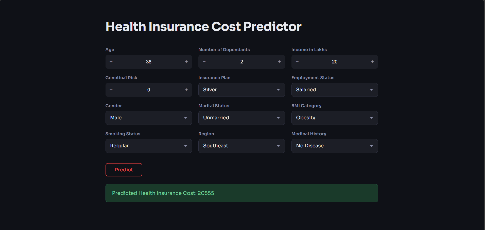

# Health Insurance Cost Predictor API

A production-ready Machine Learning API that predicts health insurance costs based on demographic, financial, and medical attributes. The application is built using FastAPI and containerized with Docker for scalable and consistent deployment.

---

## Application Preview

---

## Project Overview

This project exposes a trained machine learning model through a REST API built with FastAPI. The system estimates health insurance premiums based on user-provided inputs such as age, income, dependants, lifestyle, and medical history.

The backend is fully containerized using Docker, making it portable and deployment-ready for cloud environments.

---

## Features

- Predict insurance premium based on multiple user inputs
- FastAPI-based REST API
- Input validation using Pydantic
- Pre-trained Scikit-learn models
- Docker containerization
- Interactive API documentation via Swagger UI
- Modular backend structure

---

## Tech Stack

- Python
- FastAPI
- Scikit-learn
- Pydantic
- Uvicorn
- Docker
- HTML/CSS

---

## Project Structure

health-insurance-cost-predictor-fastapi/
│
├── backend/
│ ├── main.py
│ ├── prediction_helper.py
│
├── frontend/
│ └── index.html
│
├── artifacts/
│ ├── model_young.joblib
│ ├── model_rest.joblib
│ ├── scaler_young.joblib
│ ├── scaler_rest.joblib
│
├── Dockerfile
├── requirements.txt
└── README.md

